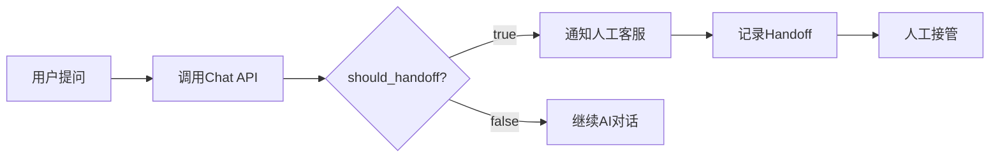

# API 使用指南

**版本**: 1.0.0  
**基础 URL**: `http://localhost:8000`

---

## 📚 目录

1. [快速开始](#快速开始)
2. [认证说明](#认证说明)
3. [API 端点详解](#api端点详解)
4. [使用示例](#使用示例)
5. [错误处理](#错误处理)
6. [最佳实践](#最佳实践)

---

## 快速开始

### 访问 API 文档

启动后端后，访问：

- **Swagger UI**: http://localhost:8000/docs
- **ReDoc**: http://localhost:8000/redoc

### 基本请求格式

所有请求使用 JSON 格式：

```bash
curl -X POST "http://localhost:8000/api/chat" \
  -H "Content-Type: application/json" \
  -d '{
    "customer_id": 1,
    "message": "M30的价格是多少？",
    "language": "zh-cn"
  }'
```

---

## 认证说明

**当前版本**: 无需认证（MVP 阶段）

**生产环境建议**:

- 使用 API Key 认证
- 配置 OAuth 2.0
- IP 白名单限制

---

## API 端点详解

### 1. 健康检查

**端点**: `GET /`

**描述**: 检查服务是否运行

**请求示例**:

```bash
curl http://localhost:8000/
```

**响应**:

```json
{
  "status": "ok",
  "message": "DJI Sales AI Assistant"
}
```

---

### 2. 创建客户

**端点**: `POST /api/customers`

**描述**: 创建新客户记录

**请求体**:

```json
{
  "name": "张经理", // 必填
  "email": "zhang@company.com", // 必填，唯一
  "phone": "13800138000", // 可选
  "company": "XX电力公司" // 可选
}
```

**响应** (201 Created):

```json
{
  "id": 1,
  "name": "张经理",
  "email": "zhang@company.com",
  "phone": "13800138000",
  "company": "XX电力公司",
  "category": "NORMAL",
  "priority_score": 3,
  "created_at": "2025-12-24T02:00:00Z"
}
```

**错误**:

- `400`: 邮箱已存在
- `422`: 数据验证失败

---

### 3. 查询客户列表

**端点**: `GET /api/customers`

**描述**: 获取所有客户（按优先级排序）

**查询参数**:

- `limit`: 返回数量（默认: 100）
- `offset`: 偏移量（默认: 0）

**请求示例**:

```bash
curl "http://localhost:8000/api/customers?limit=10&offset=0"
```

**响应**:

```json
[
  {
    "id": 3,
    "name": "王经理",
    "category": "HIGH_VALUE",
    "priority_score": 4,
    "created_at": "2025-12-24T02:30:00Z"
  },
  {
    "id": 1,
    "name": "张经理",
    "category": "NORMAL",
    "priority_score": 3,
    "created_at": "2025-12-24T02:00:00Z"
  }
]
```

---

### 4. 智能对话 ⭐

**端点**: `POST /api/chat`

**描述**: 核心功能 - 与 AI 进行对话

**请求体**:

```json
{
  "customer_id": 1, // 必填
  "message": "M30的续航时间？", // 必填
  "language": "zh-cn" // 可选，默认zh-cn
}
```

**响应** (200 OK):

```json
{
  "answer": "根据M30用户手册，M30的续航时间约为45分钟...",
  "confidence": 0.85,
  "should_handoff": false,
  "product_tag": "M30",
  "conversation_id": 1
}
```

**字段说明**:

- `answer`: AI 生成的回答
- `confidence`: 置信度 (0-1)
- `should_handoff`: 是否需要转人工
- `product_tag`: 识别的产品（M30/M400/Dock3）
- `conversation_id`: 对话会话 ID

**使用场景**:

#### 场景 1: 技术咨询

```json
{
  "customer_id": 1,
  "message": "M30适合电力巡检吗？"
}

// 响应
{
  "answer": "M30非常适合电力巡检。具备防风抗雨能力...",
  "confidence": 0.9,
  "should_handoff": false
}
```

#### 场景 2: 价格咨询（触发转人工）

```json
{
  "customer_id": 1,
  "message": "M30的价格是多少？我们需要50台"
}

// 响应
{
  "answer": "关于批量采购价格，建议您联系我们的销售团队...",
  "confidence": 0.5,
  "should_handoff": true  // ✅ 触发转人工
}
```

---

### 5. 客户分类

**端点**: `POST /api/classify/{customer_id}`

**描述**: 基于对话历史自动分类客户

**路径参数**:

- `customer_id`: 客户 ID

**请求示例**:

```bash
curl -X POST "http://localhost:8000/api/classify/3"
```

**响应**:

```json
{
  "category": "HIGH_VALUE",
  "priority_score": 4,
  "reason": "客户明确提及购买50台M30用于电力巡检项目，并询问了价格和技术细节，符合优质客户的分类标准。"
}
```

**分类标准**:

| 类别       | priority_score | 典型特征           |
| ---------- | -------------- | ------------------ |
| HIGH_VALUE | 4-5            | 大额采购、明确需求 |
| NORMAL     | 3              | 常规咨询           |
| LOW_VALUE  | 1-2            | 仅问价、无购买意向 |

---

### 6. 查看对话历史

**端点**: `GET /api/conversations/{customer_id}`

**描述**: 获取客户的所有对话

**请求示例**:

```bash
curl "http://localhost:8000/api/conversations/1"
```

**响应**:

```json
[
  {
    "id": 1,
    "customer_id": 1,
    "messages": [
      {
        "id": 1,
        "sender": "CUSTOMER",
        "content": "M30的续航时间？",
        "created_at": "2025-12-24T02:00:00Z"
      },
      {
        "id": 2,
        "sender": "AI",
        "content": "根据M30用户手册...",
        "ai_confidence": 0.85,
        "created_at": "2025-12-24T02:00:05Z"
      }
    ],
    "created_at": "2025-12-24T02:00:00Z"
  }
]
```

---

### 7. 记录转人工

**端点**: `POST /api/handoff`

**描述**: 手动记录转人工事件

**请求体**:

```json
{
  "conversation_id": 1,
  "trigger_reason": "客户要求人工报价",
  "agent_name": "销售张三"
}
```

**响应**:

```json
{
  "id": 1,
  "conversation_id": 1,
  "trigger_reason": "客户要求人工报价",
  "agent_name": "销售张三",
  "created_at": "2025-12-24T02:30:00Z"
}
```

---

## 使用示例

### Python 示例

```python
import requests

# 1. 创建客户
customer = requests.post(
    "http://localhost:8000/api/customers",
    json={
        "name": "李经理",
        "email": "li@company.com",
        "company": "XX科技"
    }
).json()

customer_id = customer["id"]

# 2. 开始对话
response = requests.post(
    "http://localhost:8000/api/chat",
    json={
        "customer_id": customer_id,
        "message": "M30和M400有什么区别？"
    }
).json()

print(f"AI回答: {response['answer']}")
print(f"置信度: {response['confidence']}")

# 3. 检查是否需要转人工
if response["should_handoff"]:
    # 记录转人工
    requests.post(
        "http://localhost:8000/api/handoff",
        json={
            "conversation_id": response["conversation_id"],
            "trigger_reason": "客户询问价格",
            "agent_name": "销售王五"
        }
    )

# 4. 分类客户
classification = requests.post(
    f"http://localhost:8000/api/classify/{customer_id}"
).json()

print(f"客户类别: {classification['category']}")
print(f"优先级: {classification['priority_score']}")
```

---

### JavaScript 示例

```javascript
// 1. 创建客户并开始对话
async function chatWithAI() {
  // 创建客户
  const customer = await fetch("http://localhost:8000/api/customers", {
    method: "POST",
    headers: { "Content-Type": "application/json" },
    body: JSON.stringify({
      name: "赵经理",
      email: "zhao@company.com",
    }),
  }).then((r) => r.json());

  // 开始对话
  const chatResponse = await fetch("http://localhost:8000/api/chat", {
    method: "POST",
    headers: { "Content-Type": "application/json" },
    body: JSON.stringify({
      customer_id: customer.id,
      message: "M30适合哪些应用场景？",
    }),
  }).then((r) => r.json());

  console.log("AI回答:", chatResponse.answer);

  // 检查转人工
  if (chatResponse.should_handoff) {
    alert("需要转人工客服！");
  }
}
```

---

## 错误处理

### 标准错误响应

```json
{
  "detail": "错误描述信息"
}
```

### HTTP 状态码

| 状态码 | 说明         | 处理方式         |
| ------ | ------------ | ---------------- |
| 200    | 成功         | -                |
| 201    | 创建成功     | -                |
| 400    | 请求错误     | 检查请求参数     |
| 404    | 资源不存在   | 检查 ID 是否正确 |
| 422    | 数据验证失败 | 检查字段格式     |
| 500    | 服务器错误   | 联系技术支持     |

### 常见错误

#### 1. 邮箱已存在

```json
{
  "detail": "Email already registered"
}
```

**解决**: 使用不同的邮箱或查询现有客户

#### 2. 客户不存在

```json
{
  "detail": "Customer not found"
}
```

**解决**: 检查 customer_id 是否正确

#### 3. LLM 服务异常

```json
{
  "answer": "抱歉，我遇到了一些技术问题，请稍后再试。",
  "confidence": 0.0
}
```

**解决**: 检查 Ollama 服务是否运行

---

## 最佳实践

### 1. 对话管理

**✅ 推荐做法**:

- 为每个客户创建唯一的 customer_id
- 保持对话连续性（使用同一 customer_id）
- 定期调用分类 API 更新客户等级

**❌ 避免**:

- 频繁创建重复客户
- 跨客户混用对话

---

### 2. 性能优化

**并发请求**:

```python
import asyncio
import aiohttp

async def chat_batch(customer_ids, messages):
    async with aiohttp.ClientSession() as session:
        tasks = [
            session.post(
                "http://localhost:8000/api/chat",
                json={"customer_id": cid, "message": msg}
            )
            for cid, msg in zip(customer_ids, messages)
        ]
        return await asyncio.gather(*tasks)
```

---

### 3. 错误重试

```python
import time

def chat_with_retry(customer_id, message, max_retries=3):
    for i in range(max_retries):
        try:
            response = requests.post(
                "http://localhost:8000/api/chat",
                json={"customer_id": customer_id, "message": message},
                timeout=30
            )
            response.raise_for_status()
            return response.json()
        except requests.exceptions.RequestException as e:
            if i == max_retries - 1:
                raise
            time.sleep(2 ** i)  # 指数退避
```

---

### 4. 转人工流程

**推荐工作流**:



**代码示例**:

```python
def handle_chat(customer_id, message):
    # 调用Chat API
    response = requests.post(...).json()

    # 检查转人工标志
    if response["should_handoff"]:
        # 记录转人工事件
        handoff = requests.post(
            "http://localhost:8000/api/handoff",
            json={
                "conversation_id": response["conversation_id"],
                "trigger_reason": "AI判断需转人工",
                "agent_name": None  # 待分配
            }
        ).json()

        # 通知人工客服系统
        notify_agent(customer_id, handoff["id"])

    return response
```

---

## 附录

### API 变更日志

**v1.0.0** (2025-12-24)

- ✅ 初始版本发布
- ✅ 核心 API 端点完成
- ✅ Swagger 文档完善

---

### 联系支持

- **技术文档**: http://localhost:8000/docs
- **问题反馈**: [GitHub Issues]
- **邮箱**: support@example.com

---

**最后更新**: 2025-12-24
